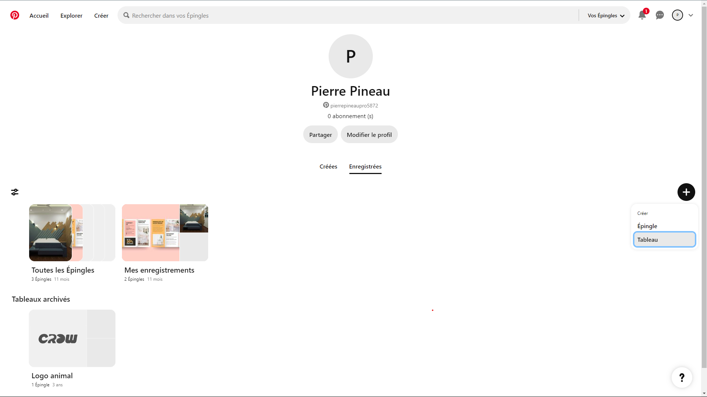
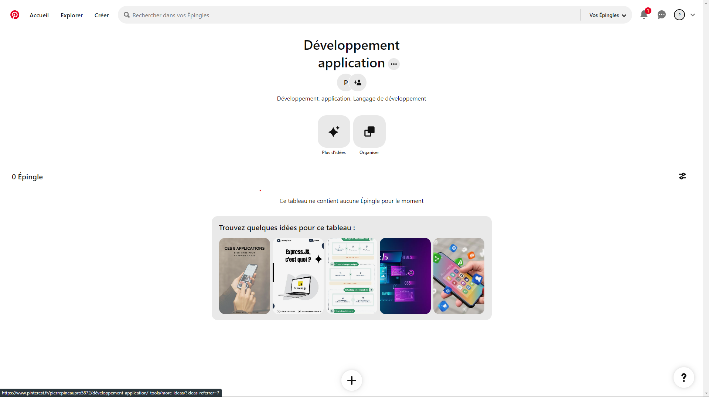

# Pinterest

Pinterest est une plateforme visuelle de découverte et de collecte d'idées, souvent utilisée pour le partage de photos et d'inspirations. Elle permet aux utilisateurs de "pinner" des images et des vidéos à des tableaux thématiques, facilitant ainsi l'organisation et la recherche de contenu visuel. 

Pinterest comprend plusieurs fonctionnalités qui permettent de faire de la veille telle que les tableaux, les utilisateurs peuvent créer des tableaux pour organiser le contenu par thème ou projet, facilitant ainsi la gestion et la recherche de ressources visuelles spécifiques. Pinterest intègre aussi les suggestions personnalisées, l’algorithme propose du contenu basé sur les intérêts et l'historique de navigation de l'utilisateur, ce qui peut aider à découvrir de nouvelles tendances et inspirations. 

De plus, certains "pins" contiennent des informations supplémentaires comme des recettes, des articles ou des produits, ajoutant une dimension informative à l’image. Pinterest offre une approche visuelle pour la veille informationnelle.

## Avantages

- Visuel attractif : Facilite l'organisation et la présentation d'idées sous forme visuelle
- Organisation par tableaux : Les tableaux thématiques permettent une classification claire et une gestion facile des ressources.
- Suggestions personnalisées : Offre un flux constant de nouvelles idées basées sur les intérêts de l'utilisateur.
- Collaboration : Permet le travail en équipe sur des projets de veille.

## Inconvénients

- Dépendance aux images : Principalement centré sur le contenu visuel, ce qui peut limiter l’analyse de données textuelles ou numériques.
- Recherche limitée : Moins puissant pour les recherches textuelles approfondies par rapport aux outils spécialisés dans l'analyse de texte.
- Contenu parfois "superficiel" : Le contenu est souvent inspirant mais peut manquer de profondeur analytique.

## Workflows

1. Créer un tableau thématique :

- Identifiez un sujet ou domaine d'intérêt.
- Créez un tableau sur Pinterest dédié à ce sujet.
- Ajoutez des descriptions et des hashtags pertinents pour améliorer la recherche.
    
2. Recherche et pinning :

- Utilisez la barre de recherche pour trouver des images et vidéos liées à votre sujet.
- Pinnez le contenu pertinent à votre tableau.
- Suivez d'autres utilisateurs et tableaux pour enrichir votre veille.

3. Collaboration et partage :

- Invitez des collaborateurs à votre tableau pour ajouter du contenu (Pinterest propose une fonctionnalité de collaboration, permettant aux utilisateurs de collaborer sur un même tableau).
- Partagez vos tableaux sur d'autres réseaux sociaux pour élargir votre audience.

## Tuto

### 1. Créer un tableau :

Cliquez sur "+".
Sélectionnez "tableau" pour créer un nouveau tableau.
Donnez un nom et une description à votre tableau.

### 2. Recherche de contenu :

Utilisez la barre de recherche en haut de la page.
Entrez des mots-clés liés à votre sujet.
Sélectionnez les pins et ajoutez-les à votre tableau.

3. Enrichissement des Suggestions :

Au fur et à mesure des recherches et des pins ajoutés dans le tableau, Pinterest proposera des contenu qui seront similaires à ce que vous recherchez

## Authors

- [@PierrePineau](https://github.com/PierrePineau)

