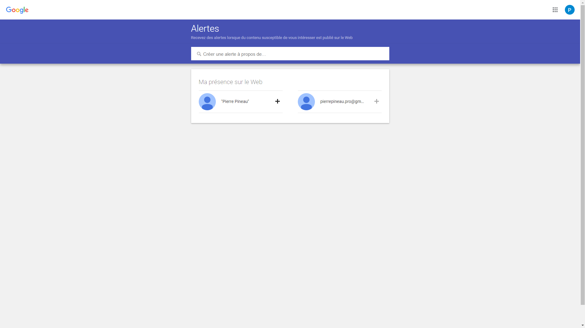
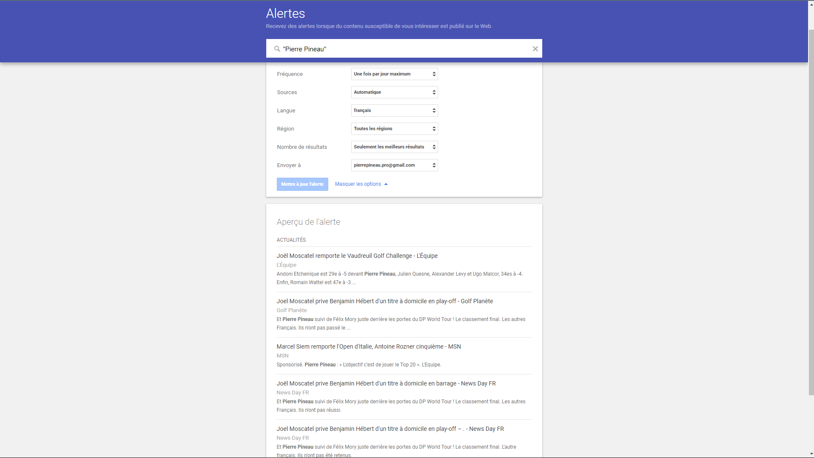

# Google Alertes

Google Alertes est un service gratuit de veille informationnelle proposé par Google. Il permet de surveiller le web pour des mots-clés spécifiques et de recevoir des notifications par e-mail ou flux RSS lorsqu'un nouveau contenu correspondant est publié. Google Alertes est un outil utile pour suivre l'actualité, surveiller la réputation en ligne, effectuer une veille concurrentielle ou obtenir des informations sur des sujets spécifiques.

## Avantages

- Surveillance continue : Permet de suivre en temps réel les nouvelles publications sur des sujets spécifiques.
- Personnalisation : Possibilité de définir des mots-clés, des sources, des langues et des fréquences de notification personnalisées.
- Gratuité : Service gratuit offert par Google, accessible à tous les utilisateurs disposant d'un compte Google.

## Inconvénients

- Limites de couverture : Ne couvre pas l'ensemble du web, certains contenus peuvent ne pas être indexés par Google.
- Bruit informationnel : Risque de recevoir des alertes non pertinentes ou redondantes en fonction des mots-clés choisis.
- Fiabilité des sources : Les informations provenant de sources peu fiables peuvent être incluses dans les alertes.

## Workflows

1. Veille concurrentielle : 

- Créez des alertes pour surveiller les activités de vos concurrents, les nouvelles de l'industrie ou les tendances du marché.
- Analysez les alertes reçues pour identifier les opportunités ou les menaces potentielles pour votre entreprise.
- Ajustez les termes de recherche et les paramètres d'alerte pour affiner les résultats au fil du temps.

2. Réputation en Ligne : 

- Identifiez les mots-clés liés à votre marque, vos produits, votre domaine d'activité et vos principaux dirigeants.
- Entrez chaque mot-clé un par un dans la barre de création d'alerte.
- Ajustez la fréquence des alertes en fonction de la sensibilité de l'information (en temps réel pour les situations critiques, quotidien pour le suivi régulier).
- Utilisez les filtres de sources pour cibler les types de contenu les plus pertinents (articles de presse, forums, réseaux sociaux, etc.).
- Analysez les résultats pour détecter toute mention négative ou positive de votre marque.

## Tuto

### 1. Créer une alerte :

Accédez à la page Google Alertes.

Entrez les mots-clés que vous souhaitez surveiller. Personnalisez les paramètres de l'alerte (langue, région, fréquence, sources, etc.).

### 2. Recevoir des notifications :

Google vous enverra des alertes par e-mail ou flux RSS lorsqu'un nouveau contenu correspondant à vos mots-clés est publié.

Consultez régulièrement vos alertes pour rester informé des dernières publications.

### 3. Analyser et partager :

Analysez les alertes reçues pour identifier les tendances, les nouvelles opportunités ou les menaces.

### 4. Ajuster les paramètres :

Modifiez les paramètres de vos alertes en fonction de vos besoins et de la pertinence des résultats reçus.

## Authors

- [@PierrePineau](https://github.com/PierrePineau)