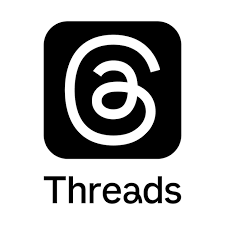
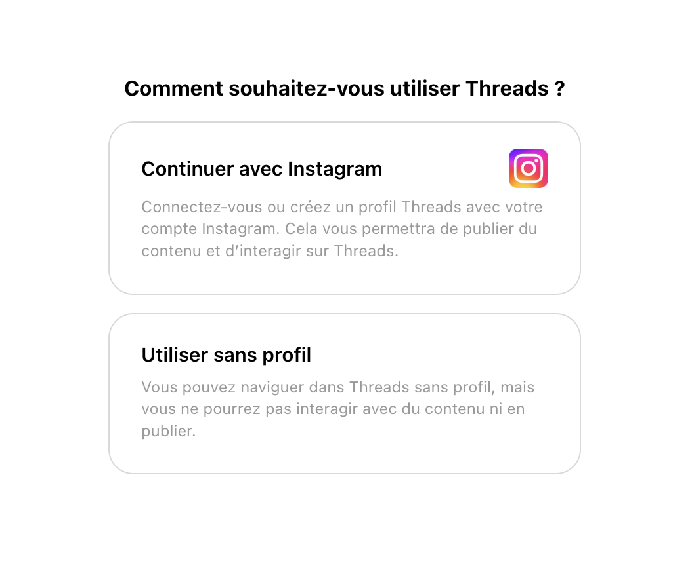
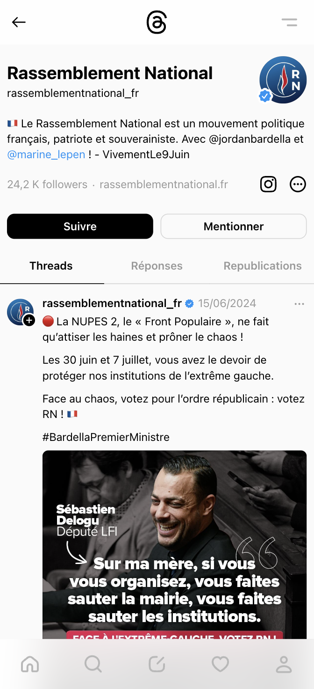

# Présentation de Threads

Threads est un média social de microblogage détenu par la société américaine Meta, la société mère de Facebook et Instagram. Il est lancé le 5 juillet 2023 dans plusieurs pays, dont les États-Unis et le Royaume-Uni. Le 14 décembre 2023, l'application est officiellement lancée à travers l’Europe et en France. L’application n’étant pas conforme aux règles de collecte de données privées, elle n’était pas disponible avant dans les pays de l’Union Européenne.

Threads est principalement conçu comme une extension d'Instagram, permettant aux utilisateurs de partager des messages courts, des photos et des vidéos dans un format de fil de discussion, conçu pour être une alternative à Twitter.

## Avantages et inconvénients

### Avantages

- Intégration avec Instagram : Étant développé par Meta, il est bien intégré avec Instagram. Les utilisateurs peuvent facilement se connecter via Instagram, ce qui facilite la transition vers Threads.
- Interface simple et intuitive : L’application est conçue pour être facile à utiliser, avec une interface minimaliste qui met l’accent sur les interactions directes et les conversations en temps réel.
- Mise en avant des contenus textuels : Elle met l’accent sur les messages textuels courts, offrant une alternative pour les utilisateurs qui préfèrent ce format, contrairement à Instagram qui est principalement axé sur les photos et vidéos.

### Inconvénients

- Dépendance à Meta : Threads étant une application de Meta, il est soumis aux mêmes controverses et préoccupations liées à la confidentialité et à l’utilisation des données.
- Fonctionnalités limitées : En comparaison avec Twitter, il possède des fonctionnalités limitées, notamment en termes de découverte de contenu et de diversité des formats de publications. Il manque également des fonctionnalités présentes sur d’autres plateformes comme la messagerie privée.
- Concurrence intense : Il entre dans un marché déjà saturé avec des concurrents bien établis comme Twitter, ce qui rend difficile l’acquisition d’une base d’utilisateurs significative.

## Workflows

**1. Créer un compte Threads :**

- Télécharger l’application ou se rendre sur le site internet.
- Se connecter avec votre compte Instagram.

**2. Suivre les comptes influents et pertinents :**

- Identifier et suivre les comptes influents dans le domaine.
- Utiliser la barre de recherche pour trouver des experts, des journalistes et des organisations qui publient sur le sujet.
- Activer les notifications sur les comptes pour être prévenu de leurs activités.

**3. Interagir et sauvegarder les informations pertinentes :**

- Consulter régulièrement les dernières notifications pour suivre les derniers posts.
- Participer aux discussions en commentant ou en partageant.
- Sauvegarder les posts importants pour une consultation ultérieure.

## Tuto

**Étape 1 : Télécharger et se connecter au compte via Instagram :**

**Étape 2 : Naviguer dans l’interface de Threads :**

- **Accueil :** La page d’accueil affiche les derniers threads des comptes que vous suivez.
- **Recherche :** Permet de rechercher les comptes.
- **Notifications :** Consulter les notifications pour voir les interactions (mentions, réponses, likes, partages).
- **Création d’un thread :** Permet de créer un thread.
- **Activité :** Consulter l’activité de votre compte (invitation, réponses, mention, citation).
- **Profil :** Accéder aux profils, threads, réponses.

**Étape 3 : Suivi d’un compte :**

- Vous pouvez rechercher un compte et le suivre pour l’avoir dans votre fil d’actualité.
- Vous pouvez également activer les notifications sur ce compte pour être alerté lorsqu’il poste.
- Vous pouvez également enregistrer les threads pertinents pour les consulter ultérieurement.

