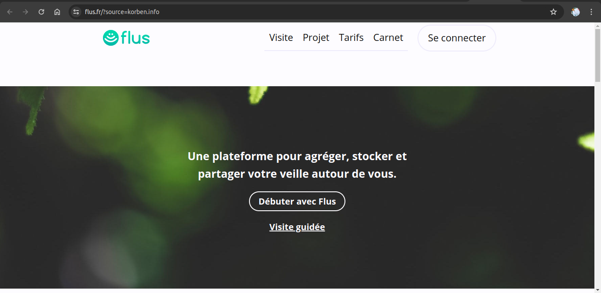
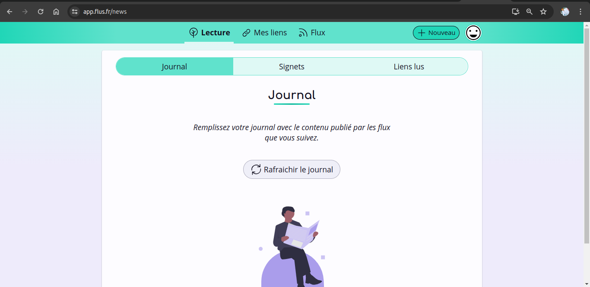
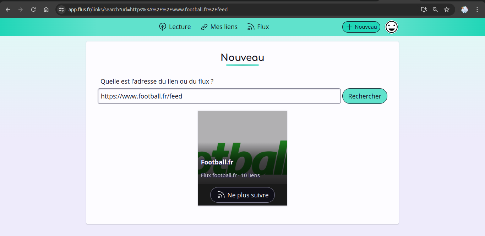

# Flusio

## Présentation de l'outil

Flusio est un outil de veille qui permet de suivre des informations sur des sujets précis et sélectionnés en amont. Ce logiciel libre permet de réaliser sa veille à partir de flux RSS mais aussi grâce à l’utilisation de signets.

Son utilisation est simple et tourne principalement autour des liens. Il suffit d’ajouter de nouveaux liens de médias, de sites, de podcasts ou encore de chaînes YouTube pour accéder à leur flux RSS et suivre l’ensemble de leurs articles ou épisodes. Commencez par créer vos collections qui vous permettront d’organiser vos liens et de partager vos passions auprès d’une communauté. Vous pouvez enrichir votre veille en suivant les collections d’autres utilisateurs.

L’interface de l’outil est composée de 3 onglets qui correspondent à ses principales fonctionnalités :

- **Journal** : permet de sélectionner des suggestions de liens à lire depuis vos signets et vos collections suivies,
- **Signets** : à la manière de marques pages, ils donnent la possibilité de ranger des liens à lire plus tard,
- **Collections** : vous avez la possibilité d’organiser vos liens, de mettre vos collections en public afin qu’elles soient suivies par la communauté.

Flusio n’utilise pas le scroll infini et propose 3 manières de lire les nouveaux liens d’articles :

1. Les dernières publications depuis vos collections suivies,
2. 3 liens de moins de 10 minutes depuis vos signets,
3. 1 lien de plus de 10 minutes depuis vos signets.

Côté tarif, l’outil de veille propose une formule unique à 3€ par mois ou 30€ par an. Il propose un mois d’essai gratuit.

Flusio est accessible via tous les navigateurs et propose une extension pour Firefox et Chrome.

Flusio combine flux RSS et signets pour une veille informationnelle efficace.

Malheureusement, comme tout bon logiciel libre, ce n’est pas simple à installer pour les débutants. Il vous faudra votre propre serveur équipé de git, nginx, php et postgreSQL. Et le tout devra fonctionner en HTTPS, donc il faudra penser au certificat SSL.

Il existe une version en ligne de [Flusio](https://flus.fr/?source=korben.info) qui s’appelle Flus.fr et qui vous permettra d’en profiter sans rien installer.

## Avantages et inconvénients

**Avantages :**
- **Combinaison de flux RSS et signets :** Permet une veille complète et diversifiée.
- **Interface utilisateur simple :** Facile à naviguer et à utiliser.
- **Personnalisation des collections :** Organisez et partagez vos liens avec la communauté.
- **Accès multi-plateforme :** Accessible via tous les navigateurs et extensions disponibles pour Firefox et Chrome.
- **Formule abordable :** Tarification simple avec un mois d’essai gratuit.

**Inconvénients :**
- **Installation complexe pour les débutants :** Nécessite des compétences techniques et un serveur propre.
- **Fonctionnalités limitées dans la version gratuite :** Certaines options avancées nécessitent un abonnement.
- **Pas de scroll infini :** Peut limiter l'expérience utilisateur pour certains.

## Workflows pour une utilisation optimale

**Workflow 1 : Suivi et organisation des flux**
1. **Ajout de flux :** Ajoutez des flux RSS et des signets à Flusio en utilisant l'option "Add Feed".
2. **Collections et tags :** Organisez vos flux et signets en collections et utilisez des tags pour une gestion plus efficace.
3. **Mise en favoris :** Marquez les articles et liens importants pour les retrouver rapidement plus tard.

**Workflow 2 : Curation de contenu**
1. **Sélection d'articles :** Utilisez les outils de curation pour sélectionner les articles les plus pertinents.
2. **Partage :** Partagez les articles sélectionnés via les collections publiques.
3. **Archivage :** Archivez les articles pertinents pour un accès futur.

**Workflow 3 : Intégration de différentes sources**
1. **Importation de sources :** Importez des flux RSS et des signets directement dans Flusio.
2. **Centralisation :** Utilisez Flusio pour centraliser toutes vos sources de veille en un seul endroit.
3. **Filtrage :** Utilisez des filtres pour trier et afficher uniquement le contenu le plus pertinent.

## Mini tuto imagé

Voici un guide rapide pour prendre en main Flusio :

1. **Inscription et connexion**
   Créez un compte ou connectez vous sur [Flusio](https://flus.fr/?source=korben.info).

2. **Ajout de flux**
   
   Cliquez sur "Nouveau" et entrez l'URL du flux RSS ou du signet que vous souhaitez ajouter.
   
   
   

3. **Organisation des flux et signets**
   
   Organisez vos flux et signets en collections et utilisez des tags pour une gestion plus efficace.
   
