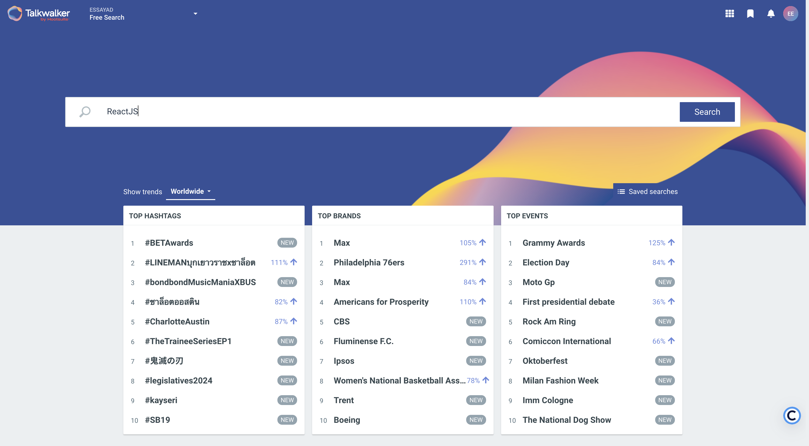
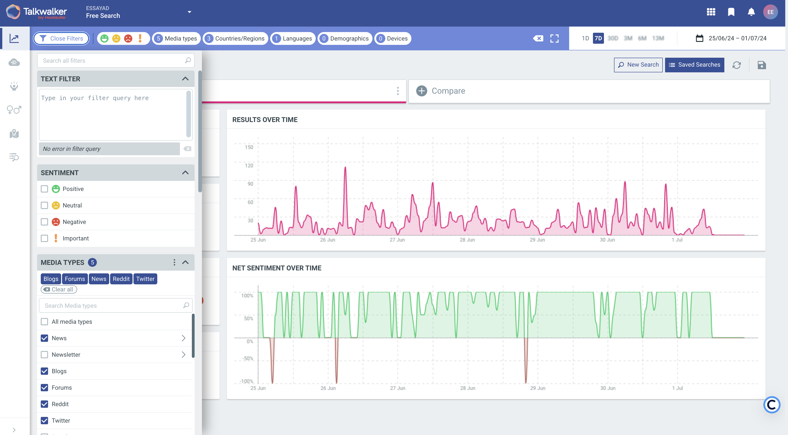
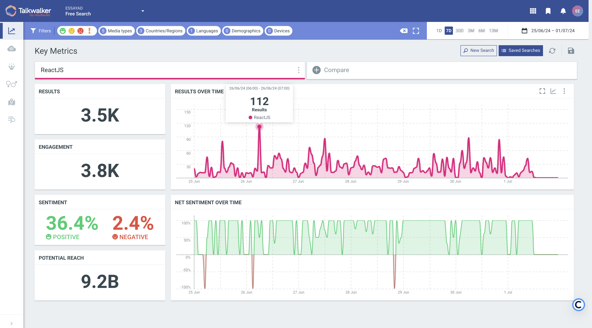
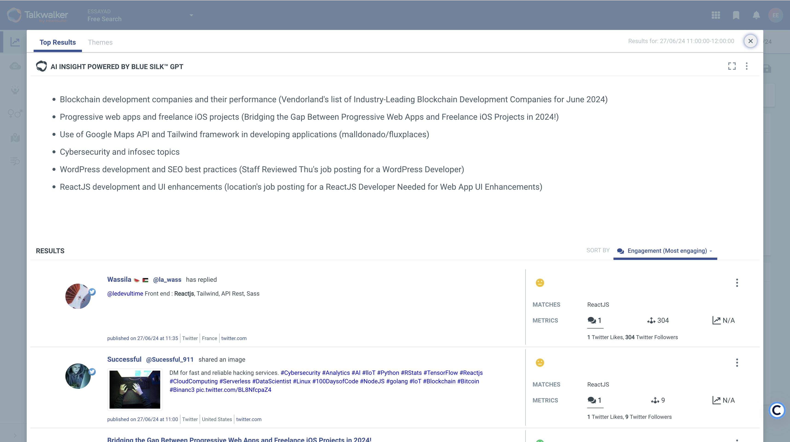

# TalkWalker

# TalkWalker

## Présentation de l'outil

TalkWalker est un outil de veille informationnelle et d'analyse de médias, conçu pour aider les entreprises à surveiller, analyser et tirer parti des conversations en ligne autour de leur marque, de leurs produits et de leurs concurrents. Il utilise l'intelligence artificielle et des algorithmes avancés pour analyser une vaste quantité de sources, y compris les réseaux sociaux, les blogs, les forums, les sites d'actualités et plus encore.

### Fonctionnalités principales

- **Surveillance des médias sociaux et des web** : Capacité à suivre les mentions de la marque sur divers canaux en temps réel.
- **Analyse de sentiment** : Comprend l'humeur des conversations pour identifier les tendances positives ou négatives.
- **Rapports personnalisés** : Génération de rapports détaillés et personnalisables pour partager les insights avec les parties prenantes.
- **Analyse des concurrents** : Comparaison des performances de la marque avec celles des concurrents.
- **Visualisation des données** : Graphiques et tableaux interactifs pour une meilleure interprétation des données.
- **Alerte en temps réel** : Notifications immédiates en cas de crise ou de mention importante.

## Avantages et inconvénients de l'outil

### Avantages

- **Couverture étendue** : Surveille un large éventail de sources en ligne.
- **Analyse approfondie** : Offre des insights détaillés grâce à l'IA et à l'analyse de sentiment.
- **Interface utilisateur intuitive** : Facile à utiliser avec une interface conviviale.
- **Rapports personnalisables** : Les rapports peuvent être adaptés aux besoins spécifiques des utilisateurs.
- **Alertes en temps réel** : Permet une réaction rapide en cas de crise.

### Inconvénients

- **Coût** : Peut être coûteux pour les petites entreprises ou les indépendants.
- **Complexité des paramètres** : La configuration initiale peut être complexe et nécessite une certaine courbe d'apprentissage.
- **Dépendance aux algorithmes** : Les résultats dépendent fortement de la précision des algorithmes d'IA, qui peuvent parfois interpréter les données de manière incorrecte.

## Workflows pour une utilisation optimale

### Workflow 1 : Préparation de l'analyse concurrentielle

1. **Lister les concurrents** : Identifier les concurrents directs, indirects et potentiels.
2. **Collecter les données** : Utiliser Quick Search pour recueillir des informations sur les concurrents.
3. **Définir les métriques** : Notoriété de la marque, tarification, données financières, produits, etc.

### Workflow 2 : Analyse des stratégies concurrentielles

1. **Surveiller les réseaux sociaux** : Utiliser Quick Search pour comparer l'engagement des concurrents.
2. **Analyser les contenus** : Étudier le type de contenu publié par les concurrents et leur fréquence.
3. **Évaluer les campagnes marketing** : Identifier les campagnes réussies et les opportunités manquées.

### Workflow 3 : Optimisation de la stratégie SEO

1. **Étudier les mots-clés** : Identifier les mots-clés utilisés par les concurrents.
2. **Analyser la structure SEO** : Vérifier les titres, balises, liens internes, etc.
3. **Adapter la stratégie** : Modifier l'architecture du site et le contenu pour améliorer le classement.

# Mini tuto pour utiliser Talkwalker Free Quick Search

## Étape 1 : Accéder à Talkwalker Free Quick Search

1. **Visitez le site de Talkwalker** : Allez sur Talkwalker Free Quick Search et connectez-vous ou créez un compte si vous n'en avez pas.

## Étape 2 : Entrer les mots-clés de recherche

1. **Champ de recherche** : Entrez les mots-clés ou phrases que vous souhaitez surveiller dans le champ de recherche.

## Étape 3 : Définir les filtres de recherche

1. **Filtres** : Utilisez les filtres disponibles pour affiner les résultats par date, langue, et sources (réseaux sociaux, blogs, forums, etc.).
2. **Appliquer les filtres** : Cliquez sur "Appliquer" pour filtrer les résultats selon vos critères.

## Étape 4 : Analyser les résultats

1. **Tableau de bord** : Consultez le tableau de bord qui affiche les résultats de votre recherche.
2. **Graphiques et statistiques** : Analysez les graphiques et les statistiques pour comprendre les tendances et les mentions de vos mots-clés.

## Étape 5 : Affiner la recherche et explorer les mentions

1. **Exploration des mentions** : Cliquez sur les différentes sections pour explorer les mentions en détail.
2. **Affiner la recherche** : Si nécessaire, ajustez les mots-clés et les filtres pour affiner davantage les résultats.

## Informations complémentaires

- **Support** : TalkWalker propose un support client réactif et de nombreuses ressources en ligne pour aider les utilisateurs à tirer le meilleur parti de l'outil.
- **Intégrations** : Compatible avec de nombreuses autres plateformes et outils de marketing, facilitant l'intégration dans votre écosystème numérique existant.
- **Sécurité** : TalkWalker garantit un haut niveau de sécurité et de confidentialité des données.

## Sources
 
https://www.talkwalker.com/fr/blog/comment-effectuer-une-veille-concurrentielle
https://formadoct.doctorat-bretagneloire.fr/c.php?g=677427&p=5095316
https://www.blogdumoderateur.com/tools/talkwalker/
https://chatgpt.com/c/
 