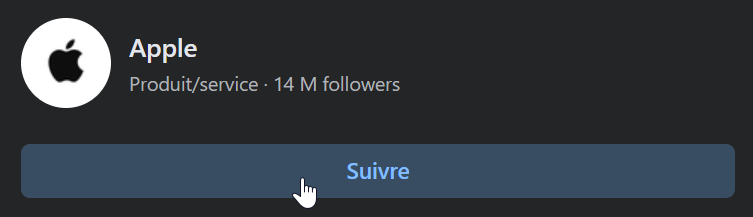

# Facebook
## Présentation

Facebook est un réseau social créé en 2004 par Mark Zuckerberg. Il permet à ses utilisateurs de se connecter avec des amis, de partager des photos, des vidéos, et des liens, et de rester en contact.

Sources : [https://fr.wikipedia.org/wiki/Facebook](https://fr.wikipedia.org/wiki/Facebook)

## Avantages
- **Connectivité** : Se connecter avec des amis, des collègues, et des connaissances pour échanger autour d'un même sujet.
- **Partage de contenu** : Partager des photos, des vidéos, des liens, et des statuts à votre cercle de contact
- **Groupes** : Rejoigndre des groupes pour discuter de sujets qui vous intéressent.
- **Pages** : Suivre des pages qui promeuvent des marques, et des projets.
- **Événements** : Rejoindre des evênements sur des sujets qui nous intéressent.

## Inconvénients
- **Algorithme** : L'algorithme de Facebook peut parfois limiter la visibilité de vos publications.
- **Désinformation** : Facebook est un lieu où la désinformation peut se propager rapidement.
- **Publicités** : Les publicités peuvent être intrusives et ciblées en fonction de vos données personnelles.

## Workflow

### Partager du contenu
1. **Publication** : Rédigez un statut, ajoutez des photos, des vidéos, ou des liens, et cliquez sur "Publier".
2. **Confidentialité** : Choisissez qui peut voir votre publication en définissant les paramètres de confidentialité.
3. **Interactions** : Réagissez aux publications de vos amis en aimant, en commentant, ou en partageant.

### Rejoindre un groupe
1. **Recherche** : Recherchez des groupes en utilisant la barre de recherche.
2. **Rejoindre** : Rejoignez des groupes qui partagent des intérêts communs avec vous.
3. **Participation** : Participez aux discussions en partageant des publications, en commentant, et en réagissant.

### Suivre des pages
1. **Recherche** : Recherchez des pages en utilisant la barre de recherche.
2. **Suivi** : Suivez des pages qui partagent des actualités qui vous intéressent.
3. **Interactions** : Interagissez avec les publications des pages en aimant, en commentant, et en partageant.

## Tutoriel imagé

### Rejoindre un groupe
Pour rejoindre un groupe sur Facebook, recherchez des groupes en utilisant la barre de recherche et cliquez sur "Rejoindre".

  

---

### Suivre des pages
Pour suivre une page sur Facebook, recherchez des pages en utilisant la barre de recherche et cliquez sur "Suivre".

  

---

### Interagir avec des publications
Pour interagir avec des publications sur Facebook, cliquez sur les boutons "J'aime", "Commenter", et "Partager".

  

