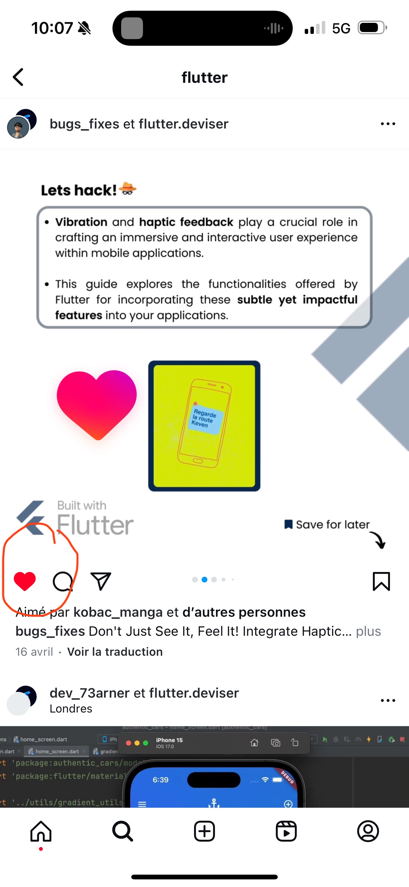
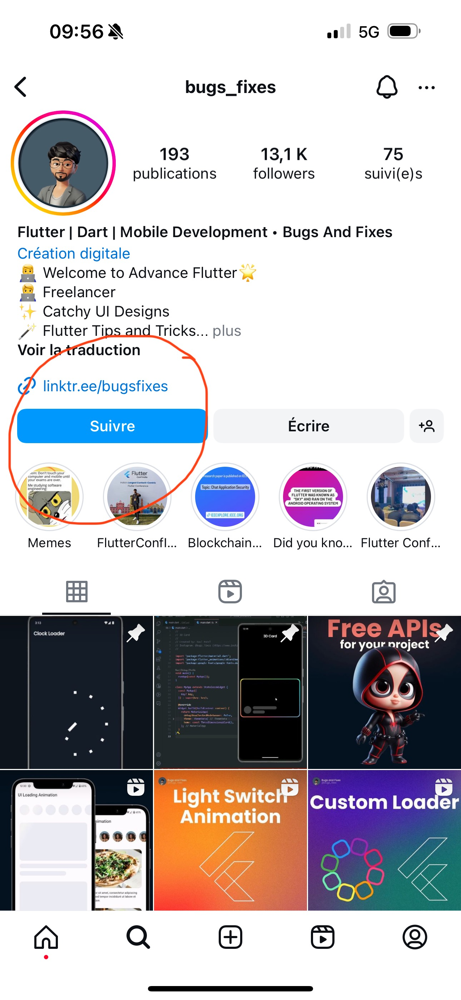
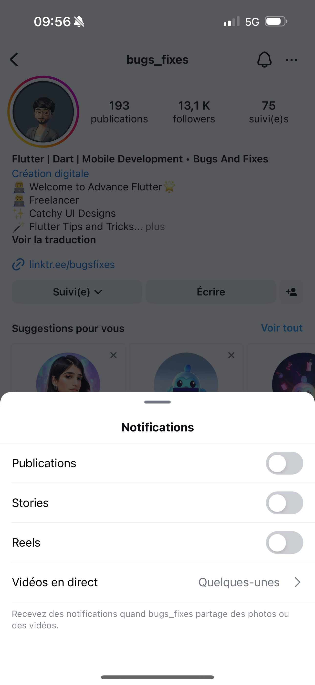

# Instagram 
## Présentation

Instagram permet de partager ses photographies et ses vidéos avec son réseau d'amis, de fournir une appréciation positive (fonction « j'aime ») et de laisser des commentaires sur les clichés déposés par les autres utilisateurs.

Elle permet aussi de dialoguer avec les autres membres via l'utilisation de la messagerie interne appelée « Instagram direct ».

Sources : https://fr.wikipedia.org/wiki/Instagram

## Avantages et inconvénients

### Avantages

- **Accès rapide au contenu** : Dès l'ouverture de l'application on peut tomber sur du contenu qui nous intéresse.
- **Facilité d'utilisation** : L'application est très intuitive.
- **Contenu visuel** : Les images et vidéos sont plus faciles à consommer que du texte.
- **Facilité d'enregistrement** : On peut enregistrer les posts qui nous intéressent pour les retrouver plus tard, les trier par collection etc...
- **Recommandations** : L'algorithme de recommandation est très bon, il permet de découvrir des comptes qui nous intéressent.

### Inconvénients

- **Très dépendant de l'algorithme** : Les contenus de veille ne sont pas souvent des comptes que l'on suit, si l'on ne s'abonne pas on dépend de l'algorithme et des recommandations qu'il peut avoir pour nous
- **Difficile de trouver des comptes à suivre** : Si justement l'algorithme ne nous recommande pas de comptes intéressants, il est difficile de trouver des comptes à suivre.
- **Se faire aspirer par du contenu inutile** : L'application est très addictive et il est facile de se retrouver à scroller sans fin sur du contenu qui ne concerne pas forcément le sujet initiale.

## Workflow

### Dompter l'algorithme

1. **Interactions** : Liker et commenter les posts pour montrer notre intérêt et faire comprendre à l'algorithme que l'on veut voir plus de ce type de contenu.
2. **Explorer** : Explorer la page d'exploration pour découvrir de nouveaux comptes et s'abonner / liker pour se voir recommander plus de contenu similaire.

### S'engager avec la communauté

1. **Stories** : Suivre les stories des comptes que l'on suit pour voir du contenu exclusif et interagir avec eux.
2. **Commentaires** : Commenter les posts pour engager la conversation / débattre avec les autres membres de la communauté.
3. **Activer les notifcaions** : Activer les notifications pour les comptes qui nous intéressent pour ne pas rater de contenu.

## Tutoriel imagé

### Trouver du contenu qui nous intéresse :
Afin que l'algorithme nous recommande des comptes qui nous intéressent il faut commencer par chercher du contenu qui nous intéresse.

  

### Liker les posts :
Pour montrer à l'algorithme que l'on veut voir plus de ce type de contenu il est intéréssant d'intéragir avec. (enregistrer, liker etc...).

  

### S'abonner aux comptes :
Si le contenu trouvé dans l'étape précédente nous intéresse, il est intéressant de s'abonner pour voir plus de contenu de ce type.

  

### Activer les notifications :
Afin de ne pas rater de contenu intéressant il est possible d'activer les notifications pour les comptes qui nous intéressent.

  

### S'informer quotidiennement :
En respectant ces étapes quotidiennement, l'algorithme nous recommandera de plus en plus de contenu qui nous intéresse et notre fil d'actualité nous permettra une veille efficace.

  

