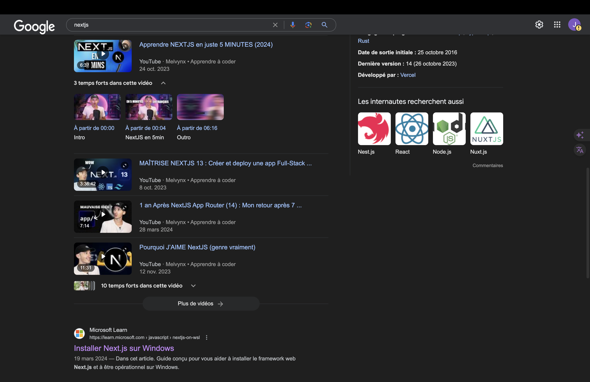
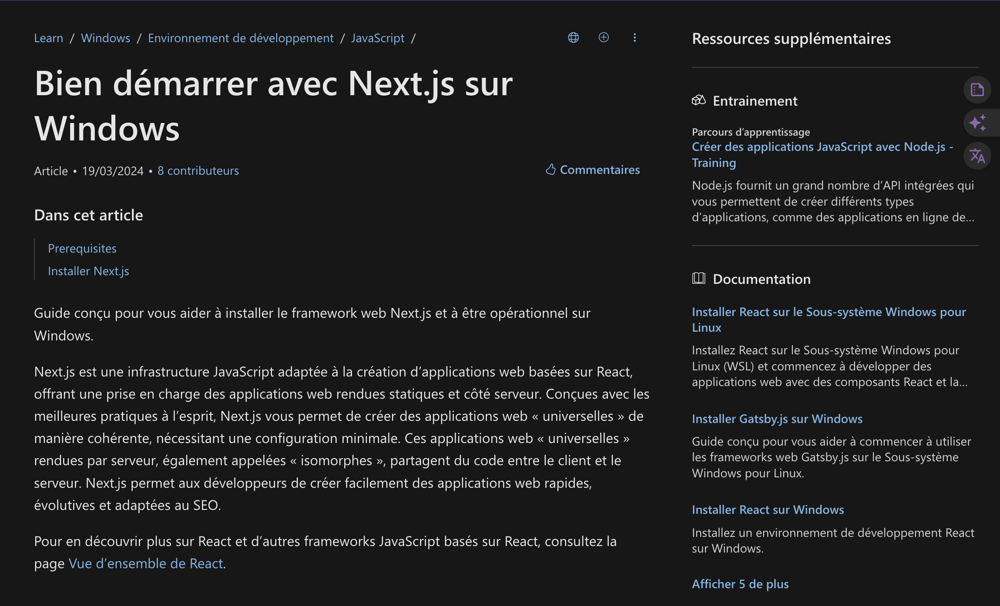

# Guide de Veille avec les Journaux en Ligne

### Objectif

Utiliser efficacement les journaux en ligne pour rester informé des actualités pertinentes dans votre domaine.

### Étapes Cruciales

#  Accès aux Sites d'Actualités :
    - Ouvrez votre navigateur web.
    - Entrez l'URL du journal en ligne.
    - Appuyez sur Entrée pour accéder au site.
    
 

# Navigation sur le Site :
    - Explorez les articles.
    - Utilisez la barre de recherche pour trouver des articles spécifiques.
    - Parcourez les catégories pour affiner vos intérêts.

# Sauvegarde d'Articles :
    - Créez un compte (si nécessaire) pour sauvegarder vos articles préférés.
    - Utilisez la fonction "Save" sur chaque article pour le sauvegarder dans votre profil.

# Personnalisation des Préférences :
    - Configurez vos préférences pour recevoir des recommandations personnalisées.
    - Choisissez vos sujets favoris pour voir du contenu pertinent.

### Conclusion
En suivant ces étapes, vous pourrez efficacement utiliser les journaux en ligne pour effectuer une veille informationnelle sur des sujets pertinents à votre domaine. Restez actif, explorez régulièrement les sites d'actualités, et continuez à découvrir et à sauvegarder des informations importantes.

## Récapitulatif des Actions Clés
1. Accès aux Sites d'Actualités
2. Navigation sur le Site
3. Sauvegarde d'Articles
4. Personnalisation des Préférences

En intégrant ces pratiques dans votre routine, vous serez toujours à jour sur les dernières évolutions et tendances de votre domaine grâce aux journaux en ligne.