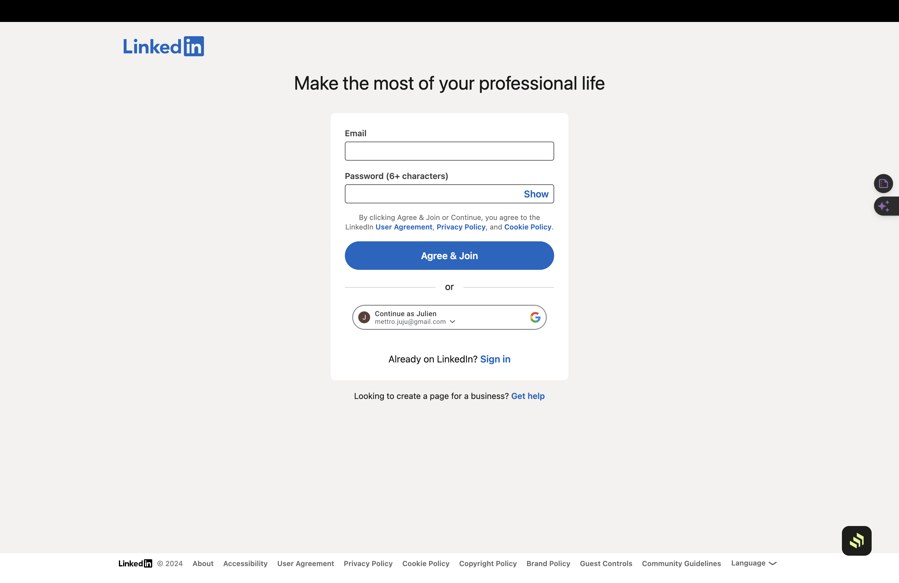
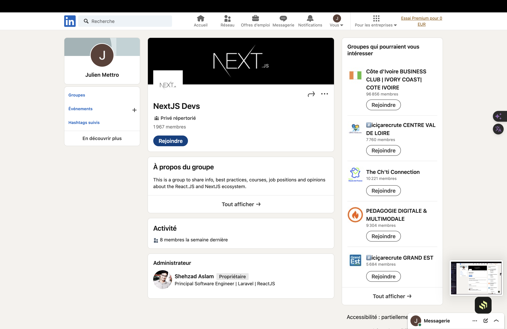
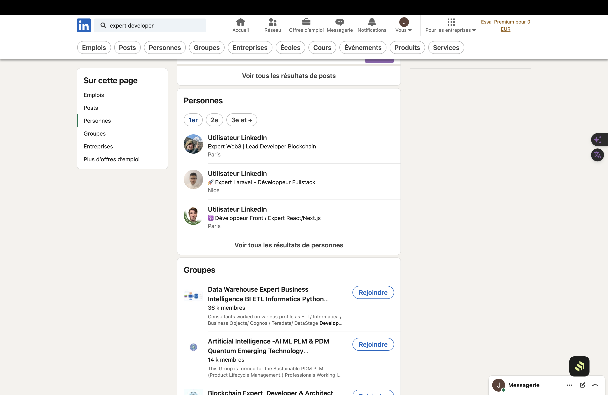
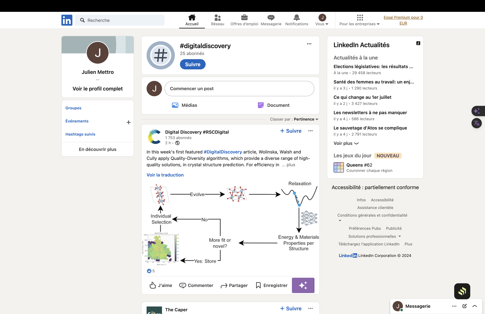
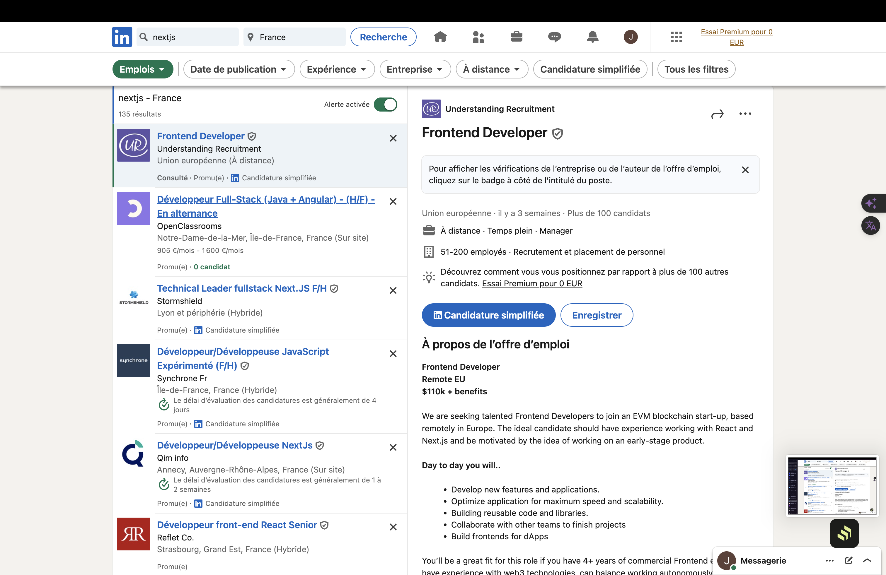

# Guide de Veille Technologique d'un sujet avec LinkedIn

## Introduction

LinkedIn est une plateforme puissante pour effectuer de la veille technologique, notamment sur des sujets spécifiques. Ce guide vous expliquera comment utiliser LinkedIn pour rester à jour avec les dernières informations, tendances et innovations liées à votre sujet.

  

## Étapes pour la Veille Technologique a l'aide de LinkedIn

### 1. **Créer et Optimiser votre Profil LinkedIn**

Pour tirer le meilleur parti de LinkedIn, il est essentiel d'avoir un profil bien optimisé.

- **Photo de Profil Professionnelle :** Utilisez une photo de profil claire et professionnelle.
  

- **Résumé et Compétences :** Ajoutez un résumé détaillé et mentionnez vos compétences liées à votre sujet et à l'environnement le concernant.
- **Expérience Professionnelle :** Décrivez vos expériences professionnelles pertinentes.

### 2. **Rejoindre des Groupes LinkedIn**

Les groupes LinkedIn sont une excellente ressource pour accéder à des discussions et à des contenus pertinents.

- **Recherche de Groupes :** Utilisez la barre de recherche en haut de la page LinkedIn pour rechercher des groupes liés à votre sujet.
- **Rejoindre des Groupes :** Rejoignez des groupes actifs (qui ont des postes récent ou un haut nombre de membres, si le groupe est en croissance de membre, c'est un bon indicateur.)
- **Participer aux Discussions :** Participez régulièrement aux discussions, posez des questions et partagez vos connaissances.
  

### 3. **Suivre des Experts et des Influencers**

Suivre des experts dans le domaine de votre sujet peut vous fournir des informations précieuses et des perspectives.

- **Recherche d’Experts :** Utilisez des mots-clés comme "Votre Sujet Expert" pour trouver des experts.
- **Suivre des Influencers :** Suivez des figures influentes et des contributeurs majeurs dans la communauté du domaine rechercher.
- **Interagir avec le Contenu :** Aimez, commentez et partagez le contenu publié par ces experts pour rester engagé et visible.
  

<!-- ### 4. **Utiliser LinkedIn Pulse et les Articles**

LinkedIn Pulse est une fonctionnalité où les utilisateurs peuvent publier des articles.

- **Recherche d’Articles :** Recherchez des articles en utilisant des mots-clés spécifiques comme "Laravel Updates" ou "Laravel Tutorials".
- **Suivre des Auteurs :** Suivez les auteurs qui publient régulièrement des articles sur Laravel.
- **Publier vos Propres Articles :** Partagez vos propres connaissances et expériences avec Laravel pour contribuer à la communauté. -->

### 4. **Utiliser les Hashtags Pertinents**

Les hashtags permettent de suivre des sujets spécifiques et d’organiser les contenus.

- **Suivre des Hashtags :** Suivez des hashtags comme #Veille, #VeilleTechno, #Update.
  

### 5. **Créer des Alertes et des Notifications**

Pour ne manquer aucune mise à jour importante, configurez des alertes et des notifications.

- **Configurer des Notifications :** Activez les notifications pour les groupes, les pages, et les personnes que vous suivez.
- **Utiliser LinkedIn Notifications :** Recevez des notifications pour les nouveaux articles, discussions et mises à jour sur votre sujet.
 

### 6. **Participer à des Événements LinkedIn**

LinkedIn propose des événements en ligne et des webinaires qui peuvent être très utiles.

- **Rechercher des Événements :** Utilisez la fonction "Événements" pour trouver des webinaires et des conférences en ligne sur votre sujet.
- **Participer et Réseauter :** Inscrivez-vous à ces événements, participez activement et connectez-vous avec d'autres participants.

### Conclusion

En suivant ces étapes, vous pourrez efficacement utiliser LinkedIn pour effectuer une veille technologique sur votre sujet. Restez actif, engagez-vous avec la communauté, et continuez à apprendre et à partager vos connaissances.

## Récapitulatif des Actions Clés

1. Optimisez votre profil LinkedIn.
2. Rejoignez des groupes liés à votre sujet.
3. Suivez des experts et des influenceurs.
4. Suivez et utilisez des hashtags pertinents.
5. Configurez des alertes et des notifications.
6. Participez à des événements LinkedIn.

En intégrant ces pratiques dans votre routine, vous serez toujours à jour sur les dernières évolutions et tendances de votre sujet sur LinkedIn.
