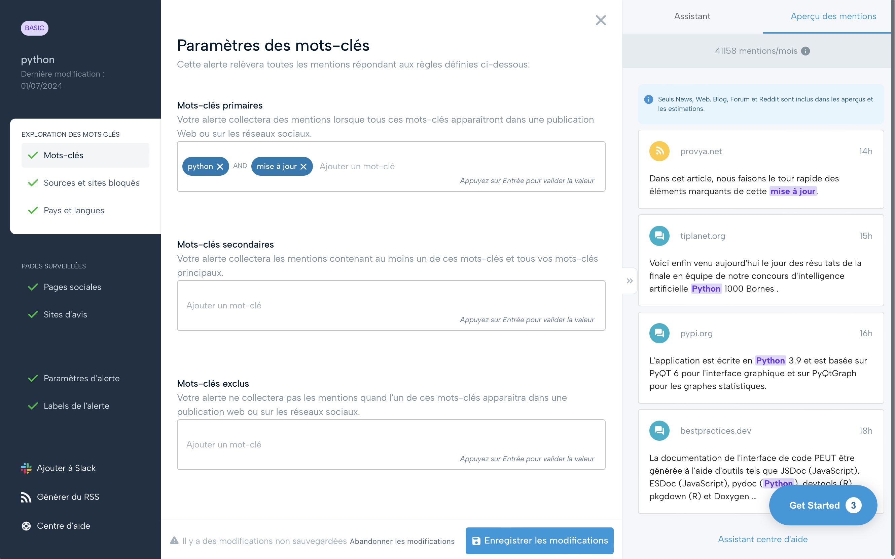
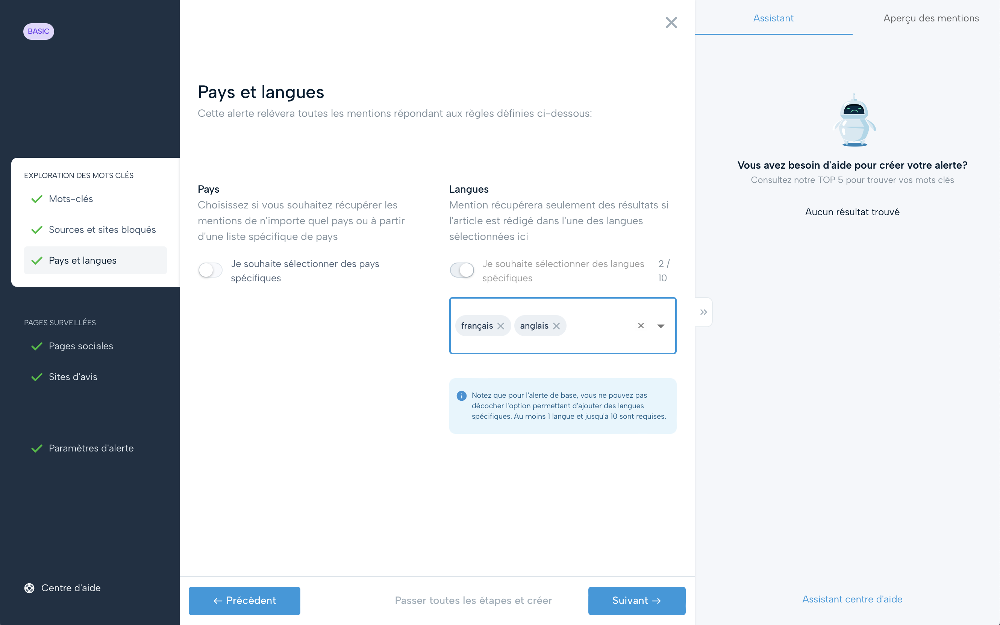
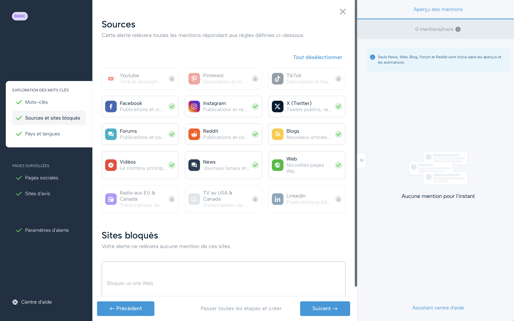
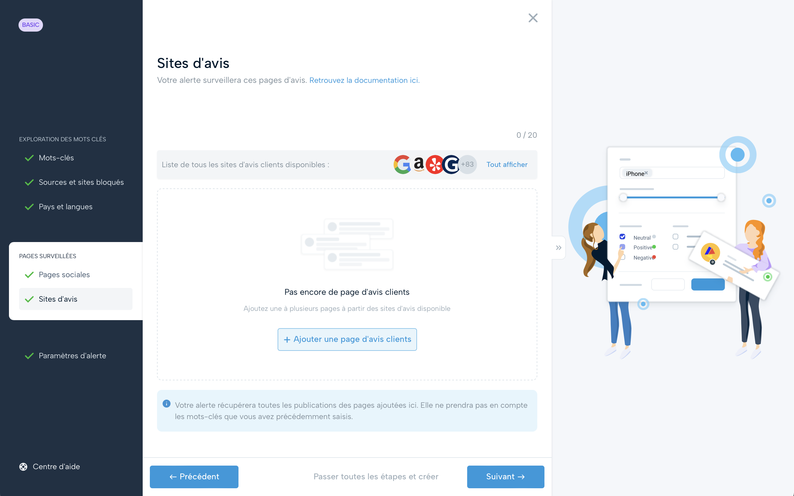
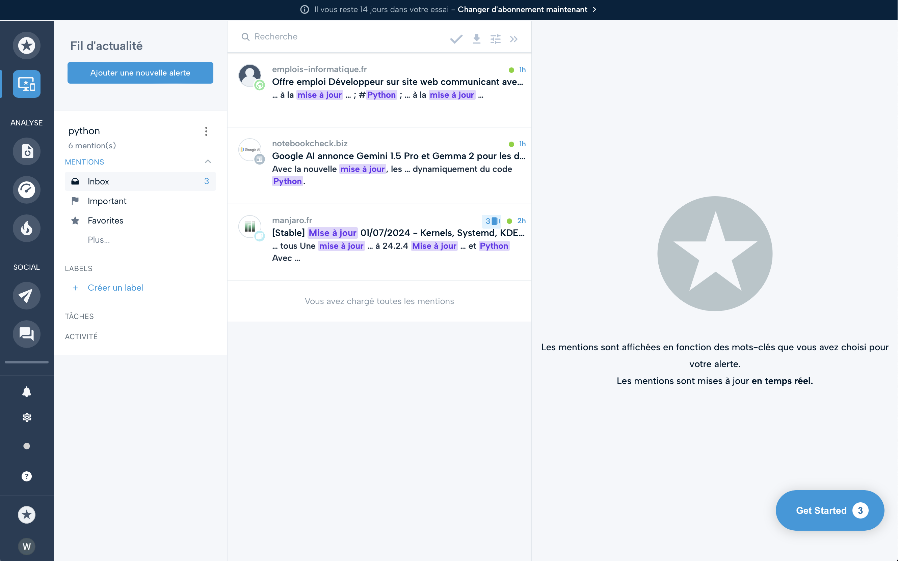
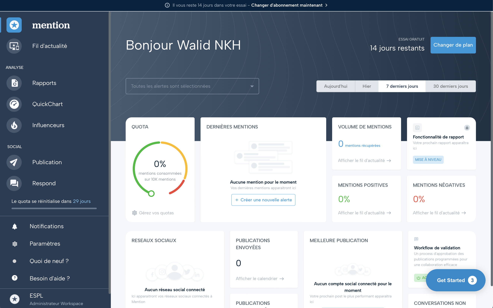

## Présentation de l'Outil : Mention

**Introduction générale**

Mention est une plateforme de surveillance des médias qui permet aux entreprises de surveiller, analyser et réagir aux conversations en ligne concernant leur marque. Grâce à ses capacités de suivi en temps réel, Mention aide les utilisateurs à rester informés des mentions de leur marque à travers diverses sources, y compris les réseaux sociaux, les forums, les blogs, et les sites d'actualités, dans notre cas, cette plateforme est parfaitement adaptée pour de la veille informationnelle.

**Fonctionnalités Clés**

- **Suivi en temps réel :** Mention collecte des données à partir d'une vaste gamme de sources en ligne, permettant aux utilisateurs de surveiller les mentions de leur marque dès qu'elles apparaissent.
- **Analyse des sentiments :** La plateforme utilise l'analyse des sentiments pour évaluer le ton et l'impact émotionnel des mentions, ce qui permet aux entreprises de comprendre mieux les perceptions de leur marque.
- **Veille concurrentielle :** Mention permet également de surveiller les concurrents pour comparer les performances et les stratégies de contenu.
- **Alertes et notifications :** Les utilisateurs peuvent configurer des alertes personnalisées pour être immédiatement informés des nouvelles mentions ou changements significatifs dans l'activité de leur marque.

## Avantages et inconvénients de l'outil

### Avantages

- **Large couverture des sources :** Mention accède à une grande variété de sources médias, offrant une vue complète de la présence en ligne d'une marque.
- **Outils d'analyse puissants :** Les outils d'analyse de Mention, y compris l'analyse des sentiments, fournissent des insights précieux sur l'opinion publique et les tendances du marché.
- **Facilité d'utilisation :** Mention est conçu pour être intuitif, permettant même aux débutants en veille médiatique de naviguer et d'utiliser la plateforme efficacement.
- **Rapports et visualisations :** La plateforme offre des rapports détaillés et des visualisations graphiques qui facilitent l'interprétation des données.

### Inconvénients

- **Coût :** Mention peut être coûteux, surtout pour les petites entreprises ou les startups avec des budgets limités.
- **Complexité des configurations :** Bien que Mention soit généralement facile à utiliser, la configuration initiale des alertes et des filtres peut être complexe et nécessiter une certaine courbe d'apprentissage.
- **Dépendance aux sources externes :** La qualité et la disponibilité des données dépendent des sources externes, qui peuvent parfois être incomplètes ou retardées.

## Workflows pour une utilisation optimale

### Définition des Objectifs de Veille
- Déterminez les aspects spécifiques de votre marque ou secteur que vous souhaitez surveiller, tels que les perceptions des consommateurs, les mentions des nouveaux produits, ou les activités des concurrents.

### Configuration des Alertes et Mots-clés
- Configurez des alertes pour les mots-clés pertinents à votre marque et à vos concurrents pour recevoir des notifications en temps réel des mentions importantes.

### Suivi et Analyse des Données
- Utilisez le Dashboard pour suivre les mentions et analyser les sentiments de façon quotidienne. Gardez un œil sur les tendances des sentiments pour ajuster les stratégies de marketing et de communication.

## Mini Tutoriel Imagé pour Prendre ses Marques sur Mention

### Étape 1: Création d'un Compte Mention
- Rendez-vous sur le site web de Mention et inscrivez-vous pour créer un compte.

### Étape 2: Configuration des Alertes

- Choisir le bon cas d'usage vous permet de personnaliser la surveillance selon vos besoins spécifiques. Notre objectif principal étant de faire de la veille sur des développements techniques ou des mises à jour spécifiques à un domaine, alors "Créer une alerte par moi-même" serait probablement l'option la plus appropriée.

- Configurez des alertes personnalisées en spécifiant les mots-clés, les sources, et les préférences de notification. Cela permet de collecter des mentions spécifiques qui incluent tous les mots-clés listés ici. Notes : mettez des mots anglais pour profiter de plus de contenu à l'internationnal. 

- Vous pouvez sélectionner des langues spécifiques pour filtrer les mentions. Mention ne récupérera des résultats que si l'article est rédigé dans l'une des langues sélectionnées. Inclure l'anglais dans la liste des langues surveillées est crucial, car l'anglais est souvent la langue dominante sur Internet et dans les affaires internationales. De nombreux contenus importants, rapports de recherche, et discussions sont publiés en anglais, même par des entités non anglophones.

- Cibler efficacement les plateformes d'où proviendront les mentions que vous souhaitez surveiller ce qui permet d'assurer que vous recevez des données pertinentes et de qualité, tout en évitant les distractions et les informations superflues.

- Cette page de Mention vous permet de surveiller spécifiquement les sites d'avis clients, essentiels pour comprendre les retours directement exprimés par les consommateurs. Pour configurer votre surveillance, cliquez sur "+ Ajouter une page d'avis clients" et sélectionnez les sites pertinents. Cela vous aidera à recueillir les opinions et les évaluations qui influencent la réputation de votre marque, en permettant une analyse fine des sentiments exprimés par vos clients.

### Étape 3: Analyse des alertes

- Cette section permet d'analyser et voir toutes les publications en fonction des alertes que vous avez configuré

### Étape 3: Tableau de bord

- Avec une bonne configuration, ce tableau de bord permet d'avoir une vue globale sur les mentions configuré avec différentes fonctionnalitées possibles.

---
Cette documentation détaille l'utilisation de Mention pour une veille informationnelle efficace, couvrant le suivi de mentions, l'analyse des sentiments, et la gestion des crises. Mention offre des outils pour surveiller la réputation de marque et les tendances du marché, avec des configurations personnalisables et un tableau de bord intuitif pour un accès rapide aux données importantes.
