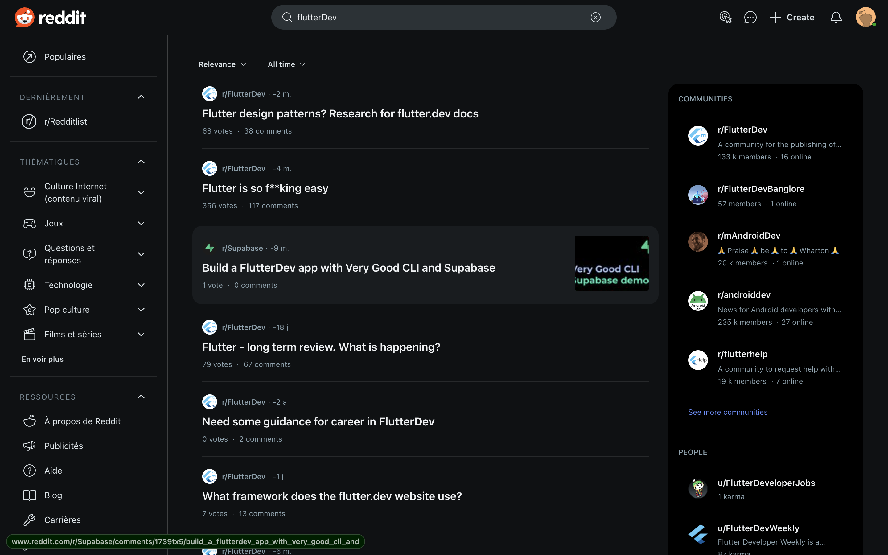
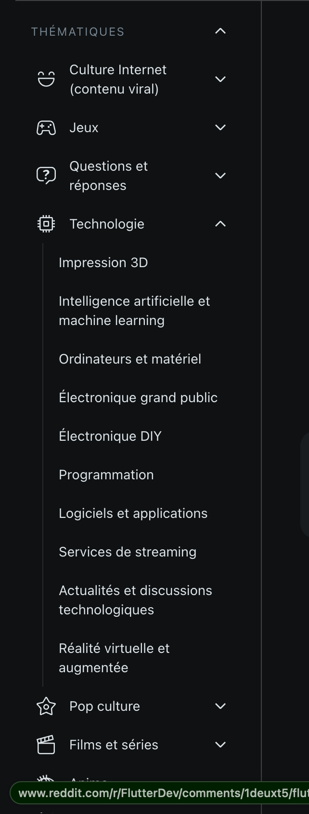
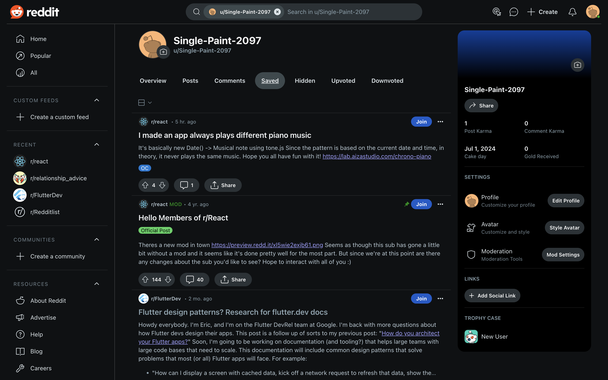
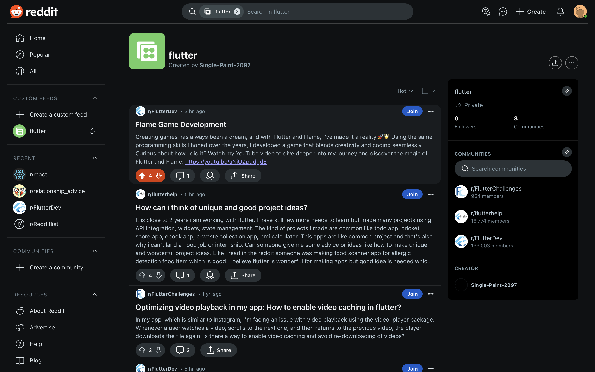

## Reddit

### Présentation de l'outil

Reddit, une plateforme de discussion sociale fondée en 2005, est organisée en sous-communautés appelées "subreddits" dédiées à divers sujets.

- Fonctionnalités :
    - **Subreddits** : Suivre des communautés spécialisées dans des domaines précis.
    - **Fonction de Recherche** : Trouver des discussions et articles sur des sujets spécifiques.
    - **Tri par Popularité et Date** : Mettre en avant les informations les plus discutées ou récentes.
    - **Discussions et Commentaires** : Participer et lire des discussions pour des perspectives variées.
    - **Alertes et Abonnements** : Recevoir des notifications pour les nouveaux posts ou commentaires.

- Avantages :
    - **Spécialisation par thématique** : Grâce aux subreddits, il est possible de suivre des sujets très précis, ce qui rend la veille beaucoup plus facile.
    - **Discussion** : Les subreddits étant assez ciblés, il sera donc plus facile d'interagir avec des professionnels ou des passionnés sur les sujets souhaités.
    - **Tri** : Il est possible de trier les posts par nouveauté ou popularité, ce qui aide notamment à se renseigner sur l'actualité rapidement.
    - **Alertes** : Possibilité de recevoir des notifications sur les nouveaux posts ajoutés aux subreddits que l'on suit.

- Inconvénients :
    - **Fiabilité** : Comme pour YouTube, les informations proposées ne sont pas toujours fiables.

## Workflow

### Workflow 1 : Recherche et abonnement aux Subreddits

1. **Recherche de Contenu** :
    - Utilisez des mots clés dans la barre de recherche afin de trouver ce qui correspond le mieux à votre domaine de compétence (par exemple : "tutoriel Python", "React Native", "Flutter").
    - Vous pouvez également utiliser des outils comme RedditList pour découvrir des subreddits populaires dans différentes catégories.

2. **Abonnement aux Subreddits** :
    - Abonnez-vous aux subreddits qui publient régulièrement du contenu pertinent et de qualité.
    - Consultez régulièrement votre flux personnalisé pour voir les nouveaux posts des subreddits auxquels vous êtes abonné.

3. **Utilisation des Flairs et des Tags** :
    - Utilisez les flairs (étiquettes) pour filtrer les posts par sujet ou par type de contenu.
    - Marquez les posts intéressants avec des tags pour les retrouver facilement plus tard.

### Workflow 2 : Upvote, sauvegarde de posts Reddit et création de collections

1. **Upvote** :
    - Upvotez les posts intéressants pour les retrouver plus facilement dans votre historique.

2. **Sauvegarde de posts Reddit** :
    - Sauvegardez les posts pertinents en utilisant la fonction de sauvegarde intégrée de Reddit.

3. **Création de Collections** :
    - Utilisez la fonctionnalité de collections pour organiser les posts sauvegardés par thème ou par projet.
    - Ajoutez des commentaires ou des notes aux posts sauvegardés pour un suivi plus facile.

### Workflow 3 : Feedly

1. Cliquez sur "Add Content" et tapez l'URL des subreddits ou des mots-clés pertinents (par exemple, "https://www.reddit.com/r/Python/").
2. Organisez vos flux en créant des dossiers par thèmes (par exemple, "Python", "Web Development", "Tech News").
3. Utilisez des tags pour organiser les articles et les posts sauvegardés par sujet ou par projet.
4. Consultez régulièrement vos flux pour voir les nouveaux articles et posts dans vos catégories organisées.
5. Sauvegardez les articles intéressants pour une lecture ultérieure. Partagez-les avec votre équipe si nécessaire.

## Tuto

Dans la barre de recherche, tapez les mots clés que vous souhaitez.

Vous pouvez également rechercher des thématiques précises.

Abonnez-vous aux subreddits qui vous paraissent les plus pertinents.

Vous pouvez sauvegarder les posts que vous souhaitez retrouver par la suite.

Vous pouvez également créer des collections personnalisées qui regroupent plusieurs communautés.
