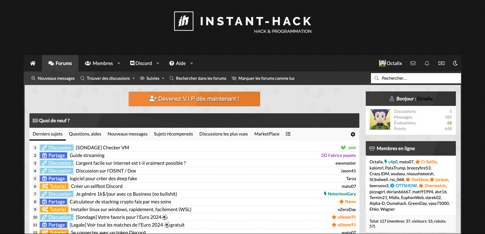
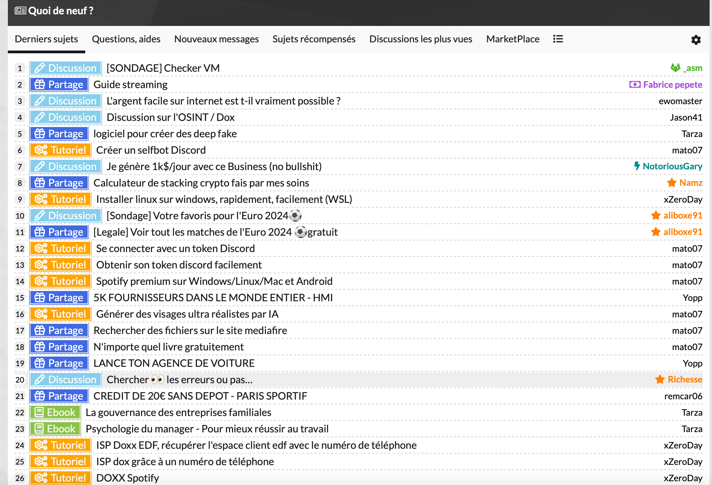
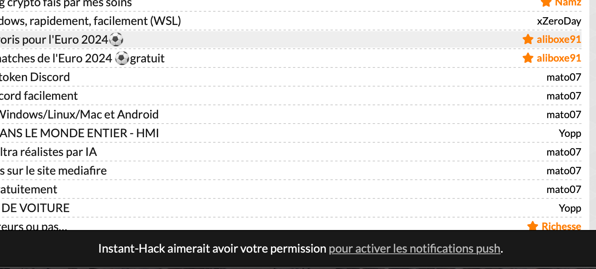

## Présentation

Le site choisi est [instant-hack.to](instant-hack.to), c'est un blog qui propose des articles sur la sécurité informatique, des tutoriels en tout genre, ebook et autres ressources gratuites.
Parmi les catégories proposées on retrouve :
- Hacking
- Programmation
- Informatique
- Marketplace
- 
---

PS : Le site n'est pas très professionnel, contient beaucoup de contenu "inutile / peu pertinent", je l'ai choisi car depuis des années (maintenant 7 ans), quand j'ai besoin d'une information "deep" sur ces sujet pas très légaux je sais que je trouverai ce que je veux là-bas et surtout que j'aurai du mal à le trouver facilement ailleurs.

---

## Avantages

- **Contenu varié** : Le site propose des articles sur des sujets variés, allant de la sécurité informatique à la programmation en passant par des tutoriels sur des outils.
- **Ressources gratuites** : Le site propose des ebooks et autres ressources gratuitement.
- **Actualité qu'on ne trouve nul part ailleurs** : Le site propose des articles sur des sujets qui ne sont pas forcément traités ailleurs (derniers leak de données, failles de sécurité, partage d'outils de hacking).

## Inconvénients
- **Communauté variée** : La communauté est très variée, la communauté étant plutôt jeune et venant d'un milieu "jeu vidéo" on peut retrouver des commentaires / articles peu constructifs.
- **Pertinence des articles** : La qualité des articles peut varier, certains articles sont très intéressants et bien écrits, d'autres sont moins pertinents.
- **Illégalité** : Le site propose des articles sur des sujets illégaux (hacking, piratage, etc...), il est donc important de ne pas utiliser ces informations à mauvais escient.

## Workflow

### Venir faire sa veille
Faire sa veille sur instant-hack peut être interessant mais il faut tout de même bien triés les artciles / informations qui ne sont pas toutes pertinentes (à peu près 1 article sur 5 est interessant).

1. **Se rendre sur le site** : Aller sur instant-hack.to pour voir les derniers articles.
2. **Tri** : Lire les titres des articles et voir si ils sont pertinents.
3. **Lecture** : Si un sujet semble interessant le lire.

### Venir trouver des informations / tutoriels concernant un sujet précis

La plupart du temps, lorsque je cherche un outil ou une informations que je ne trouverai pas ailleurs que sur instant hack, je m'y rend pour voir si il y a un article sur le sujet.

1. **Recherche** : Je commence par chercher le sujet qui m'intéresse dans la barre de recherche du site.
2. **Lecture** : Je lis l'article pour voir si il correspond à ce que je cherchais.
3. **Téléchargement** : Si l'article propose un outil ou un ebook, je répond à l'article et je télécharge la ressource.

## Tutoriel imagé

### Se rendre sur le site et se connecter
Pour accéder au contenu du site il faut se rendre sur [instant-hack.to](instant-hack.to) et se connecter.

  

### Trier par nombres d'articles affichés
De bases 10 entrées sont affichés, il est possible de changer ce nombre pour en afficher plus. (n'allant pas souvent sur le site, je mets 100 articles par page directement).

  

### Choisir un article
Il ne reste plus qu'a trié parmi les articles pertinents et en choisir un à lire.
Il est également possible de trier par catégories (citées en haut du document)

  

_PS : Sur certains articles il faut répondre pour déverrouiller le contenu et depuis peu il y a des articles avec du contenu (souvent les pieces jointes) qui sont payants (coins du site)._

## Activer les notifications
Pour ne pas rater les derniers articles, il est possible d'activer les notifications pour être averti dès qu'un nouvel article est publié.

  

