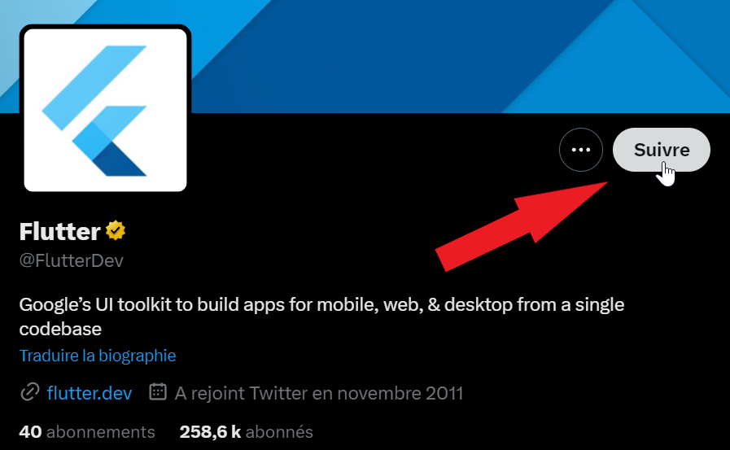
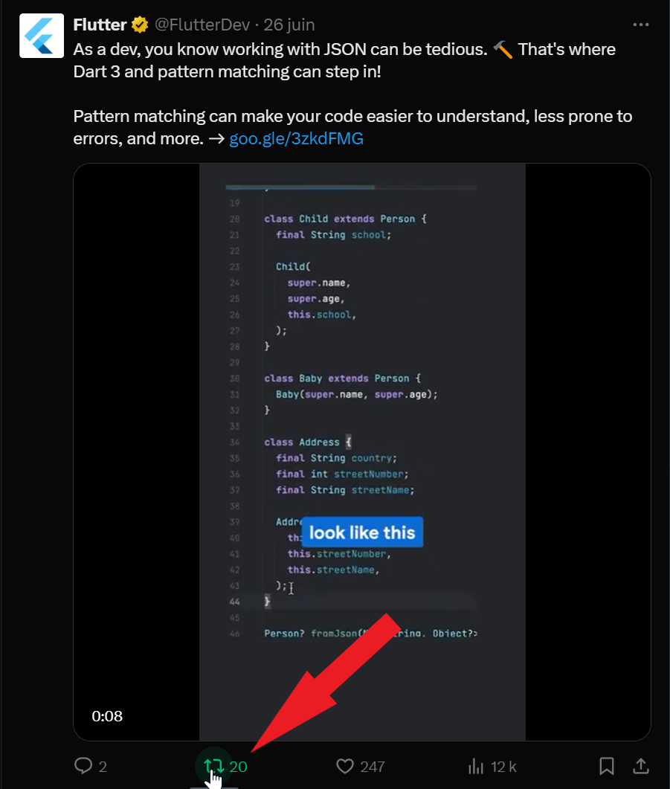

# Twitter
## Présentation
Twitter est un réseau social créé en 2006. Il permet à ses utilisateurs d'envoyer des messages courts de 280 caractères maximum. Utilisé pour partager des nouvelles, Twitter est un outil de veille très puissant pour suivre les tendances, les actualités, et les conversations autour de leur secteur d'activité.

Sources : [https://fr.wikipedia.org/wiki/Twitter](https://fr.wikipedia.org/wiki/Twitter)

## Avantages
- **Suivi des tendances** : Suivre les hashtags populaires pour rester à jour sur les sujets qui vous intéressent.
- **Suivi des comptes** : Suivre les comptes pour rester informé de leurs actualités.
- **Interactions** : Engager des conversations avec votre audience et vos pairs pour échanger des idées et des informations.
- **Notifications** : Recevoir des notifications pour ne rien manquer des actualités de vos comptes favoris.
- **Partage de contenu** : Partager des articles, des images, des vidéos, et des liens pour informer votre audience.

## Inconvénients
- **Limite de caractères** : La limite de 280 caractères peut être contraignante pour partager des informations détaillées.
- **Désinformation** : Twitter est un lieu où la désinformation peut se propager rapidement.
- **Algorithme** : L'algorithme de Twitter peut parfois limiter la visibilité de vos tweets.

## Workflow

### Suivre des comptes
1. **Recherche** : Recherchez des comptes à suivre en utilisant la barre de recherche.
2. **Abonnement** : Abonnez-vous aux comptes qui partagent des informations qui vous intéressent.

### Utiliser les hashtags
1. **Recherche** : Recherchez des hashtags populaires pour suivre les tendances.
2. **Utilisation** : Utilisez des hashtags pertinents dans vos tweets pour augmenter leur visibilité.

### Engager la conversation
1. **Répondre** : Répondez aux tweets de vos abonnés pour engager la conversation.
2. **Retweeter** : Retweetez des tweets intéressants pour les partager avec votre audience.

## Tutoriel imagé

### Recherche de comptes
Pour trouver des comptes à suivre, utilisez la barre de recherche pour rechercher des comptes pertinents.

  

---

### Suivi de comptes
Pour suivre un compte, cliquez sur le bouton "Suivre" sur le profil du compte.

  

---

### Utilisation des hashtags
Pour suivre un hashtag, recherchez-le dans la barre de recherche et cliquez sur l'onglet "Les meilleurs tweets".

  

---

### Partage de contenu
Pour partager du contenu, cliquez sur le bouton "Retweet" pour republier un post.

  

