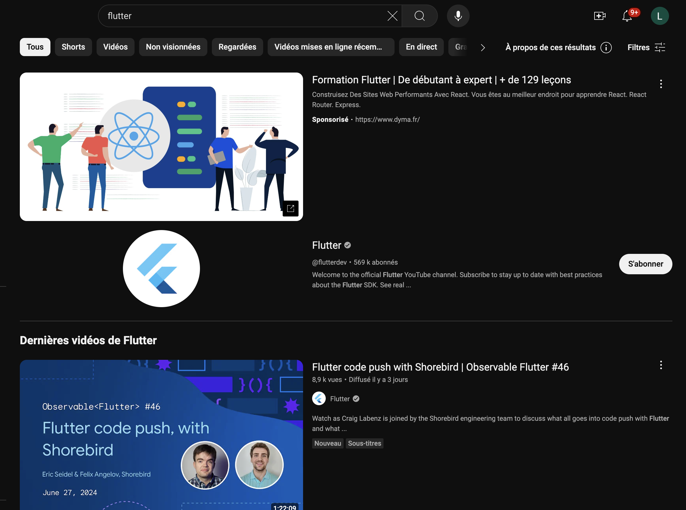
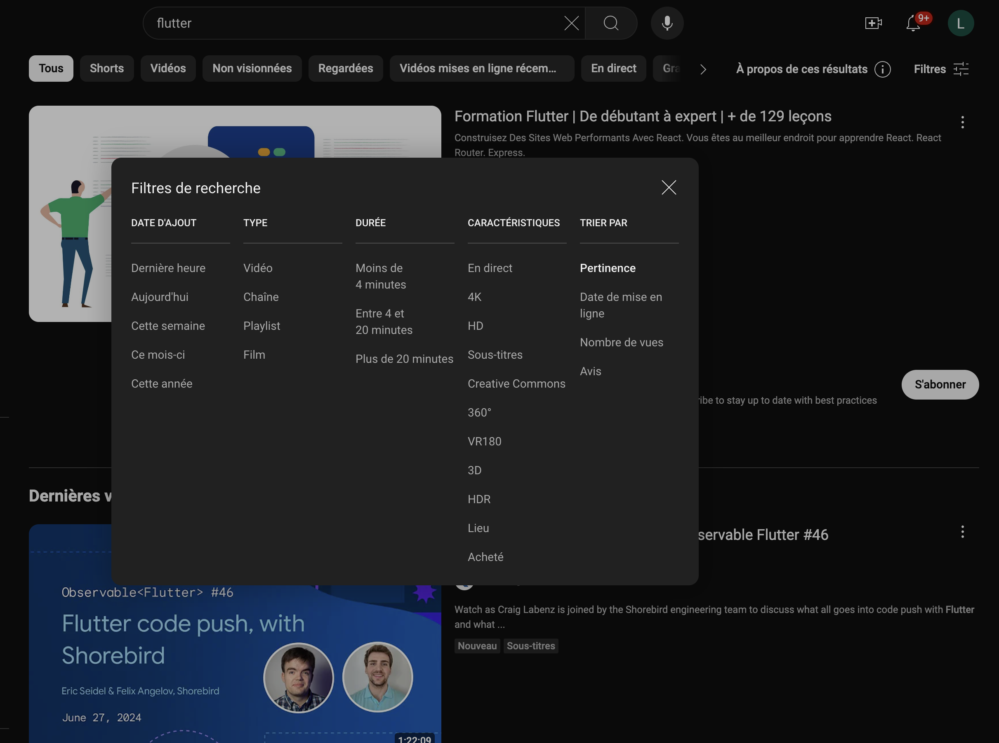
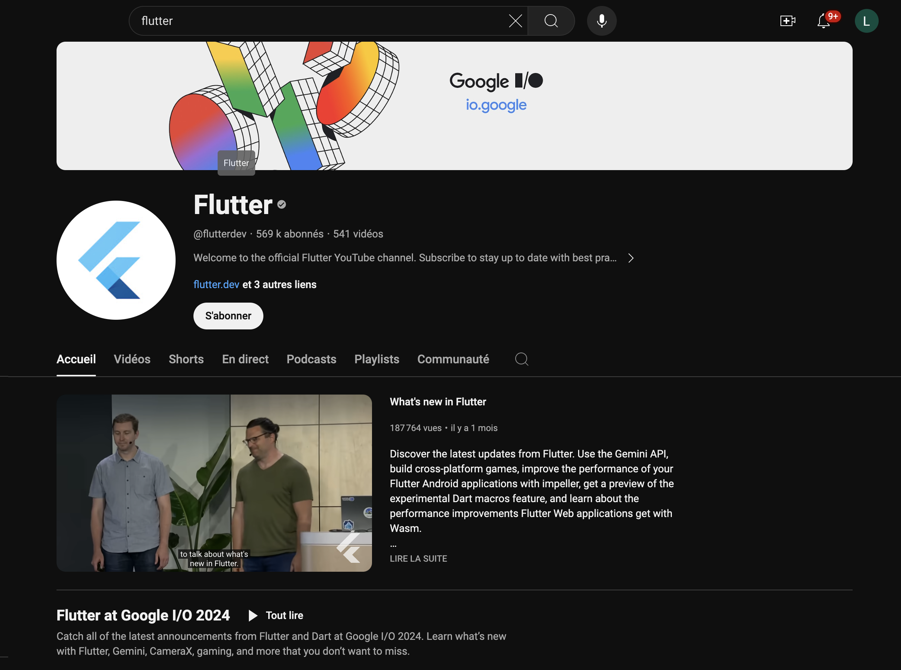
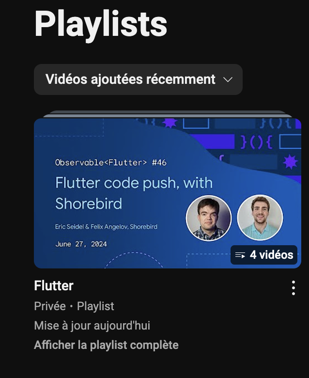
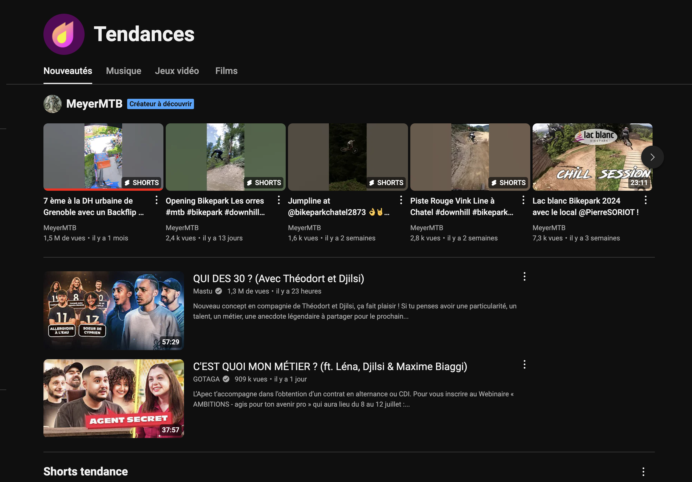

# Veille technologique

Pour expliquer les différents sites permettant de faire de la veille, nous allons partir du principe que la technologie qui nous passionne est React.

## YouTube

### Présentation de l'outil

YouTube, une plateforme de partage de vidéos fondée en 2005 et rachetée par Google en 2006, permet de télécharger, visionner, commenter et partager des vidéos.

- Fonctionnalités :
    - **Recherche Avancée** : Filtrer les résultats par date, type de vidéo, durée, etc.
    - **Abonnements et Notifications** : Recevoir des notifications pour les nouvelles vidéos des chaînes suivies.
    - **Playlists et Sauvegardes** : Organiser des vidéos par thème.
    - **Statistiques et Tendances** : Identifier les sujets populaires grâce aux sections "Tendances".

- Avantages :
    - **Playlists** : Permet de regrouper et organiser les vidéos par thème, facilitant la gestion de l'information.
    - **Fonctionnalités de recherche avancée** : Les filtres permettent de trouver des contenus précis, récents ou populaires.
    - **Large diversité de contenus** : Sur YouTube, il est possible de trouver tous les sujets possibles et imaginables.

- Inconvénients :
    - **Fiabilité des vidéos** : Toutes les vidéos ne sont pas fiables, il faut faire attention.
    - **Trop d'information** : Il existe énormément de contenu sur chaque sujet, ce qui rend la veille plus complexe.

## Workflow

### Workflow 1 : Recherche de contenu + Abonnement aux chaînes YouTube

1. **Recherche de Contenu** :
    - Utilisez des mots clés dans la barre de recherche afin de trouver ce qui correspond le mieux à votre domaine de compétence (par exemple : "tutoriel Python", "React Native", "Flutter").
    - Ensuite, filtrez les résultats par date de mise en ligne afin de trouver les vidéos les plus récentes.

2. **Abonnement aux Chaînes** :
    - Abonnez-vous aux chaînes qui publient régulièrement des vidéos fiables et pertinentes. N'hésitez pas également à activer les notifications afin d'être au courant de la sortie d'une nouvelle vidéo.

### Workflow 2 : Utilisation de l'onglet tendances + Utilisation des playlists et des favoris

1. **Utilisation de l'onglet tendances** :
    - Consultez l'onglet tendances sur YouTube pour découvrir les contenus populaires et pertinents du moment.

2. **Utilisation de playlists et favoris** :
    - Une fois vos vidéos sur un sujet trouvées, créez une playlist pour les regrouper. Vous pourrez ainsi les retrouver très facilement.
    - Ajoutez également les vidéos vraiment importantes en favoris pour les marquer.

### Workflow 3 : YouTube Analytics

1. Accédez à YouTube Studio.
2. Consultez l'onglet "Vue d'ensemble" pour obtenir un aperçu général de la performance de votre chaîne, y compris les vues, le temps de visionnage et le nombre d'abonnés.
3. Allez à l'onglet "Audience" pour comprendre qui regarde vos vidéos. Consultez les données démographiques comme l'âge, le sexe et la localisation géographique.
4. Utilisez l'onglet "Portée" pour voir d'où viennent vos spectateurs. Cela inclut les sources de trafic comme les recherches YouTube, les suggestions de vidéos et les sites externes.

## Tuto

### Recherche par mots clés

Dans la barre de recherche, tapez les mots clés que vous souhaitez.

### Tri de la recherche

Une fois votre recherche effectuée, vous pouvez décider de trier celle-ci selon plusieurs filtres, notamment la date de mise en ligne, qui permettra d'afficher les vidéos les plus récentes concernant ce sujet.

### Abonnement aux chaînes

N'hésitez pas à vous abonner aux chaînes qui publient du contenu régulièrement et pertinent, ainsi qu'aux chaînes officielles de certaines technologies (comme par exemple celle de Flutter ci-dessus) afin de vous tenir au courant des dernières nouveautés.

### Utilisation des playlists

Vous pouvez également enregistrer une vidéo dans une playlist afin de les trier par technologie et ainsi les retrouver plus facilement.

### Tendances YouTube

Vous pouvez également consulter l'onglet tendances afin de voir toutes les tendances du moment et d'être tenu au courant de toutes les nouveautés.
